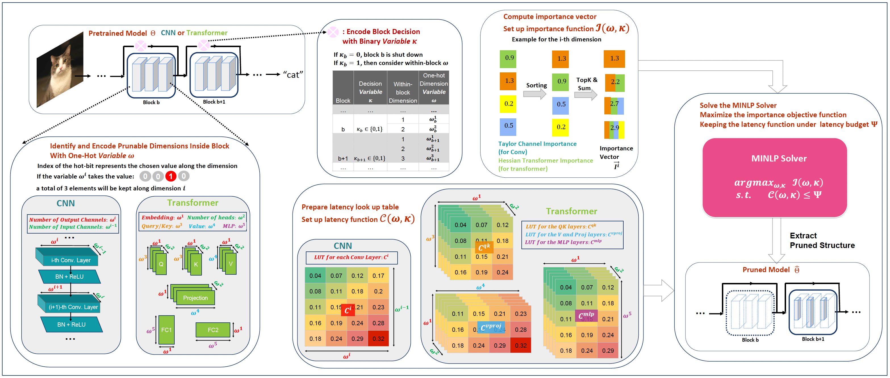
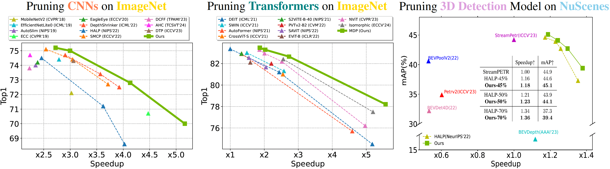

# 🎯 MDP: Multidimensional Vision Model Pruning with Latency Constraint

[](https://arxiv.org/abs/2504.02168)
[](https://cvpr.thecvf.com/virtual/2025/poster/33891)
[](https://mdp-cvpr.github.io/)
[](https://youtu.be/ktBT_SkrYHU)

<!-- [](https://opensource.org/licenses/MIT) -->

This repository contains the official implementation of MDP method introduced in our CVPR 2025 paper:

> **MDP: Multidimensional Vision Model Pruning with Latency Constraint**  
> Xinglong Sun, Barath Lakshmanan, Maying Shen, Shiyi Lan, Jingde Chen, Jose M. Alvarez

## 📋 Table of Contents
- [News](#-news)
- [Introduction](#-introduction)
- [Framework](#-framework)
- [Results](#-results)
- [Installation](#-installation)
- [Usage](#-usage)
- [Citation](#-citation)

## 📢 News
- [2025/06] I presented MDP in a [CVPR 2025 tutorial](https://cvpr.thecvf.com/virtual/2025/tutorial/35921) on Full-Stack, GPU-based Acceleration of Deep Learning and Foundation Models. You can watch the [tutorial video here](https://youtu.be/ktBT_SkrYHU)!

## 📝 Introduction

Current structural pruning methods face two significant limitations:
1. They often limit pruning to finer-grained levels like channels, making aggressive parameter reduction challenging
2. They focus heavily on parameter and FLOP reduction, with existing latency-aware methods frequently relying on simplistic, suboptimal linear models that fail to generalize well to transformers

In this paper, we address both limitations by introducing **Multi-Dimensional Pruning (MDP)**, a novel paradigm that:
- Jointly optimizes across various pruning granularities (channels, query, key, heads, embeddings, and blocks)
- Employs advanced latency modeling to accurately capture latency variations
- Reformulates pruning as a Mixed-Integer Nonlinear Program (MINLP)
- Supports both CNNs and transformers

## 🎨 Framework

<div align="center">
  
  <p><i>Overview of our MDP method</i></p>
</div>

## 📊 Results

Our extensive experiments demonstrate MDP's superior performance:

### ImageNet Classification
- **ResNet50**: 28% speed increase with +1.4 Top-1 accuracy improvement over prior art
- **DEIT-Base**: 37% additional acceleration with +0.7 Top-1 accuracy improvement over prior art

### 3D Object Detection
- Higher speed (×1.18) and mAP (0.451 vs. 0.449) compared to dense baseline

<div align="center">
  
  <p><i>MDP exhibits Pareto dominance with both CNNs and Transformers across various tasks</i></p>
</div>

## 🚀 Installation

*Code coming soon!*

## 💻 Usage

*Code coming soon!*

## 📚 Citation

If you find this repository useful for your research, please cite our paper:

```bibtex
@misc{sun2025mdpmultidimensionalvisionmodel,
    title={MDP: Multidimensional Vision Model Pruning with Latency Constraint},
    author={Xinglong Sun and Barath Lakshmanan and Maying Shen and Shiyi Lan and Jingde Chen and Jose M. Alvarez},
    year={2025},
    eprint={2504.02168},
    archivePrefix={arXiv},
    primaryClass={cs.CV},
    url={https://arxiv.org/abs/2504.02168}
}
```